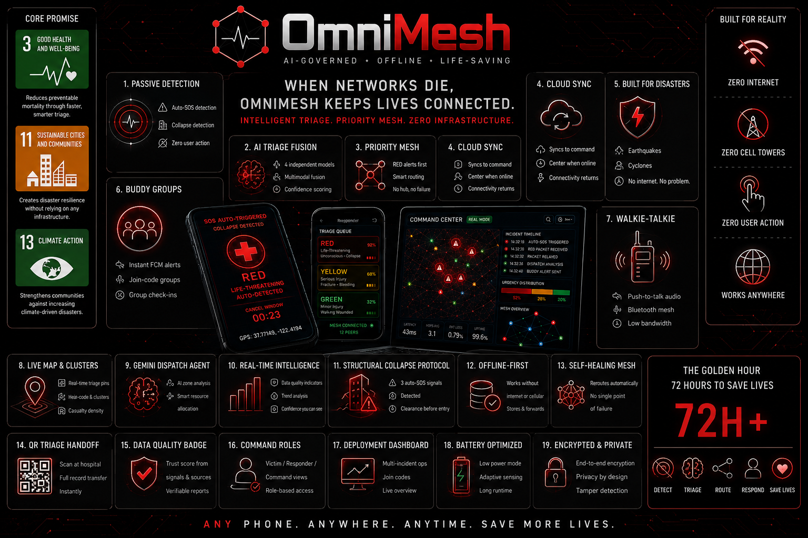
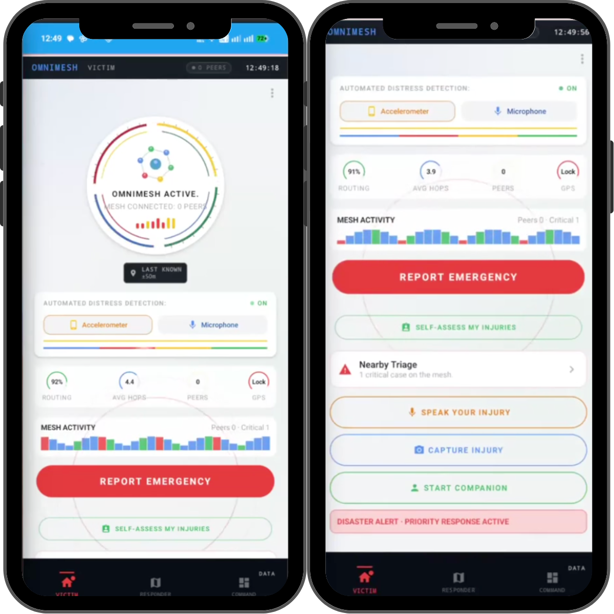
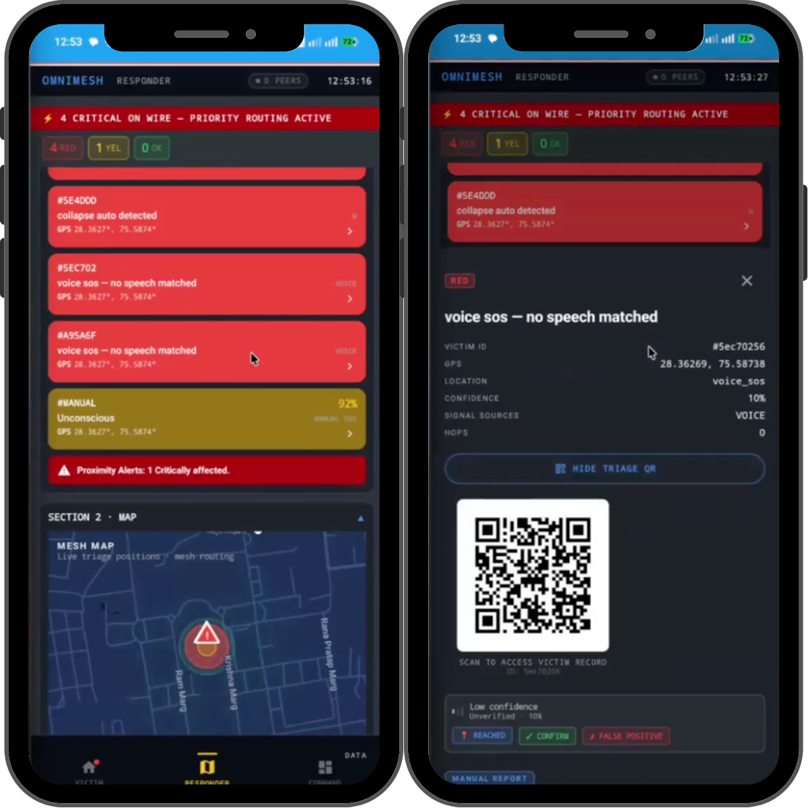
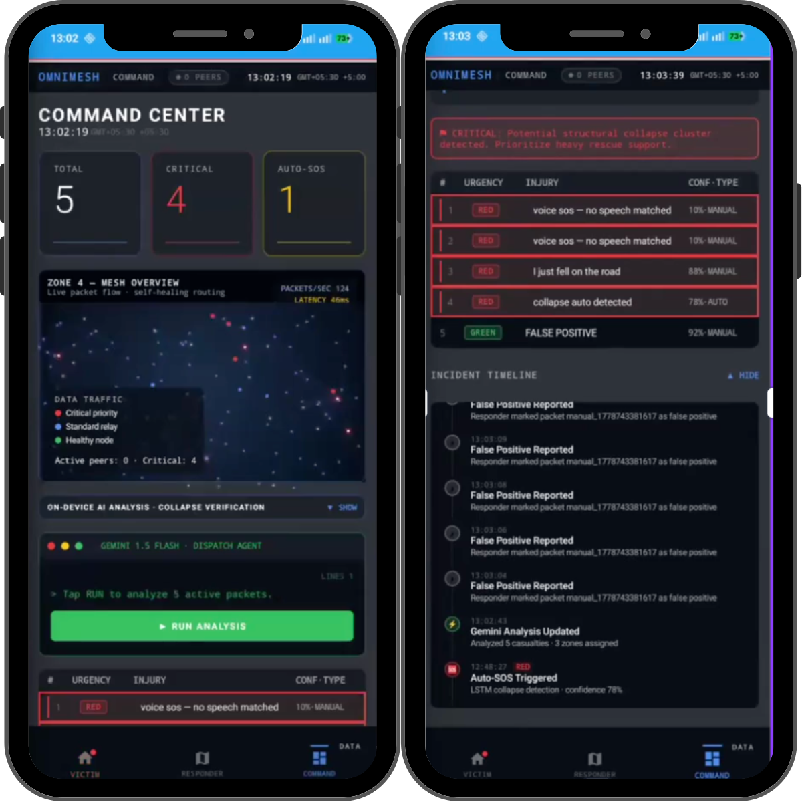
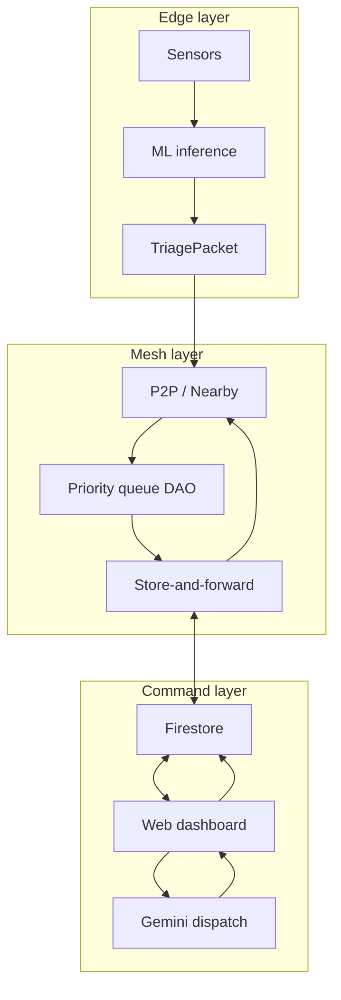
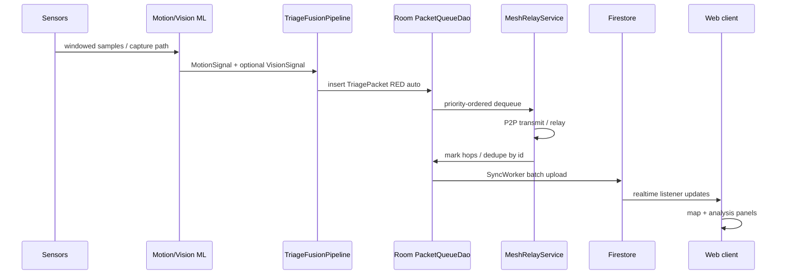
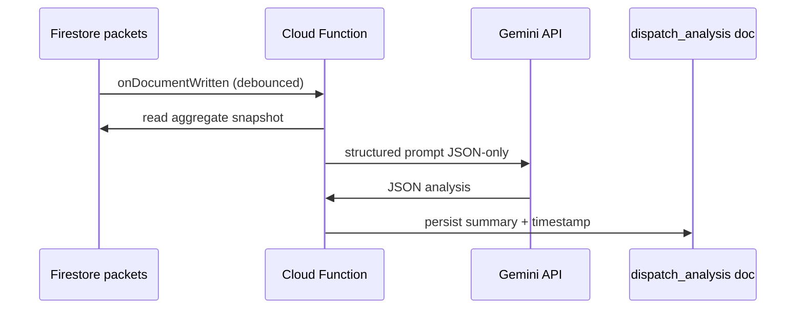
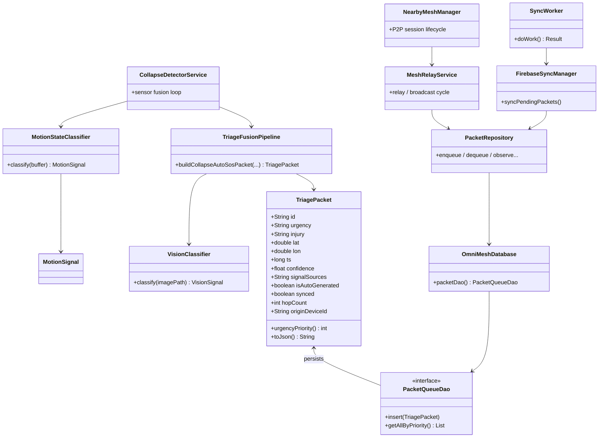
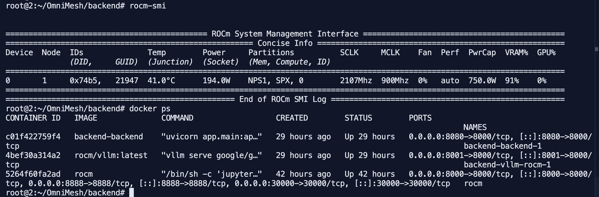

<p align="center">
  
</p>

<h1 align="center">OmniMesh</h1>

<p align="center"><strong>AI‑governed, offline‑first disaster triage mesh network</strong><br/>
<em>Edge sensing · severity‑ordered P2P relay · Firestore command plane · Gemini dispatch synthesis</em></p>

<p align="center">
  <a href="https://omnimesh-command.web.app"><strong>Live demo — omnimesh-command.web.app</strong></a><br/>
  <a href="https://github.com/Adya6714/OmniMesh/releases/download/release-v1.0/app-debug.apk"><strong>Download Android APK (release-v1.0)</strong></a><br/>
  <sub>Alternate host: <a href="https://omnimesh-command.firebaseapp.com">omnimesh-command.firebaseapp.com</a> · Firebase project <code>omnimesh-command</code> (<code>.firebaserc</code>)</sub><br/>
  <sub><strong>Source parity:</strong> Hosting serves <code>web/build</code> from the same React code as <code>npm start</code> / <code>npm run build --prefix web</code>. After UI changes, redeploy (<code>npm run deploy:hosting</code> or GitHub Actions on <code>main</code>). Hard-refresh if you still see an old shell (<kbd>Ctrl</kbd>+<kbd>Shift</kbd>+<kbd>R</kbd>). The native <strong>Android</strong> app is Jetpack Compose (<code>app/</code>) — same product flows, different codebase than <code>web/</code>.</sub>
</p>

<p align="center">
  <a href="https://github.com/Adya6714/OmniMesh/releases/download/release-v1.0/app-debug.apk"></a>
  
  
</p>

---

### Specification summary _(technical dossier format)_

| Field                       | Detail                                                                                                                      |
| --------------------------- | --------------------------------------------------------------------------------------------------------------------------- |
| **Purpose**                 | Mitigate preventable mortality in the early disaster window via structured triage telemetry and resilient propagation paths |
| **Document classification** | Public demonstration artefact — proprietary credentials withheld _(`.env`, `secrets.properties`, service accounts)_         |
| **Primary constituents**    | Android edge agents · React operational dashboard · Firebase persistence · Gemini reasoning hooks                           |

<br/>

<p align="center"><strong>Product stack · brand anchors</strong> _(official logos via shields.io; links open vendor documentation)_</p>

<p align="center">
  <a href="https://kotlinlang.org/" title="Kotlin"></a>
  <a href="https://developer.android.com/jetpack/compose" title="Jetpack Compose"></a>
  <a href="https://developer.android.com/" title="Android"></a>
  <a href="https://firebase.google.com/" title="Firebase"></a>
  <a href="https://firebase.google.com/products/functions" title="Cloud Functions"></a>
</p>
<p align="center">
  <a href="https://react.dev/" title="React"></a>
  <a href="https://leafletjs.com/" title="Leaflet"></a>
  <a href="https://nodejs.org/" title="Node.js"></a>
  <a href="https://ai.google.dev/" title="Gemini API"></a>
  <a href="https://www.tensorflow.org/lite" title="TensorFlow Lite"></a>
  <a href="https://gradle.org/" title="Gradle"></a>
</p>
<p align="center">
  <a href="https://www.amd.com/en/products/accelerators/instinct.html" title="AMD Instinct"></a>
  <a href="https://rocm.docs.amd.com/" title="ROCm"></a>
  <a href="https://fireworks.ai/" title="Fireworks AI"></a>
  <a href="https://ai.google.dev/gemma" title="Gemma"></a>
</p>

<p align="center"><sub>Supplementary SDKs in codebase include Room · WorkManager · Nearby Connections · Google Maps Platform _(optional)_.</sub></p>

<br/>

### Annex A — Android app screenshots

_Architecture diagram: see [System architecture diagram](#system-architecture-diagram) (Fig. 5) and [`docs/architecture.md`](docs/architecture.md)._

<table>
<tr>
<td align="center" colspan="2">
<b>Fig. 1 · Product overview</b><br/>
<sub>Victim · Responder · Command surfaces · mesh + AI stack</sub><br/><br/>

</td>
</tr>
<tr>
<td align="center" width="50%"><br/>
<b>Fig. 2 · Victim mode</b><br/>
<sub>Passive distress detection · REPORT EMERGENCY · voice / capture / companion</sub><br/><br/>

</td>
<td align="center" width="50%"><br/>
<b>Fig. 3 · Responder mode</b><br/>
<sub>RED-first triage queue · mesh map · packet detail · triage QR</sub><br/><br/>

</td>
</tr>
<tr>
<td align="center" colspan="2"><br/>
<b>Fig. 4 · Command mode</b><br/>
<sub>Live stats · mesh overview · Gemini dispatch · incident timeline</sub><br/><br/>

</td>
</tr>
</table>

---

### Annex B — Rapid reproduction

**Android APK (no build required):** [app-debug.apk](https://github.com/Adya6714/OmniMesh/releases/download/release-v1.0/app-debug.apk) — GitHub release `release-v1.0`.

```bash
make setup
cp web/.env.example web/.env              # Firebase web SDK keys
cp secrets.properties.example secrets.properties   # GEMINI_API_KEY (Android Vision / dispatch BuildConfig)
# Place google-services.json in app/ for package omnimesh.command1
make dev-web    # → http://localhost:3000
```

| Doc | Purpose |
| --- | --- |
| [`docs/FEATURES.md`](docs/FEATURES.md) | Complete implemented feature inventory (Android · web · backend · Functions) |
| [`docs/SETUP.md`](docs/SETUP.md) | Local setup, Firebase, Android, mesh testing, GitHub deploy secrets |
| [`docs/documentation.md`](docs/documentation.md) | Full problem statement, layer-by-layer technical design, demo narrative |
| [`docs/architecture.md`](docs/architecture.md) | Mermaid source for the Edge → Mesh → Command diagram |
| [`docs/sc/`](docs/sc/) | Android app screenshots used in Annex A |

> **Security.** Never commit `web/.env`, `secrets.properties`, `google-services.json`, or API keys in `firebase.json`. Rotate any credential previously exposed in source history.

---

<details>
<summary><strong>§ Contents · specification navigation</strong></summary>

1. [Executive summary](#executive-summary)
2. [The problem: unnecessary mortality after disasters](#the-problem-why-people-die-unnecessarily-after-disasters)
3. [Why existing mesh & messenger tools fail](#why-existing-technology-fails)
4. [The OmniMesh response](#the-solution-ai-governed-mesh-infrastructure)
5. [Feature inventory](#feature-inventory)
6. [High-level design (HLD)](#high-level-design-hld)
7. [System architecture diagram](#system-architecture-diagram)
8. [Low-level design (LLD)](#low-level-design-lld)
9. [Key classes (diagram)](#key-classes-class-diagram)
10. [Theory & design rationale](#theory-documentation)
11. [Technology stack](#technical-stack-summary)
12. [What makes OmniMesh unique](#what-makes-omnimesh-unique)
13. [UN SDG alignment](#un-sdg-alignment)
14. [Demo narrative](#the-demo-moment)
15. [Repository layout & setup](#repository-layout--setup)
16. [Setup guide](docs/SETUP.md)  
17. [Full technical documentation](docs/documentation.md)  
18. [Feature inventory](docs/FEATURES.md)  
19. [Architecture diagram source](docs/architecture.md)  
20. [Documentation vs. this repository](#documentation-vs-this-repository)

</details>

---

## Executive summary

Disasters destroy communications faster than they destroy every phone in the rubble. **OmniMesh** turns smartphones into **priority-aware triage nodes** that can:

- **Infer severity** from multiple passive or assisted signals (motion, vision, audio pathway, fusion).
- **Emit compact triage packets** (JSON / Room entities) suitable for constrained radio paths.
- **Route packets by medical priority** (RED before YELLOW before GREEN) through **P2P mesh** semantics.
- **Reconcile with the cloud** via **Firestore** so incident command sees a living picture — then ask a **Gemini dispatch agent** for structured operational synthesis.

This README merges **problem framing**, **system theory**, **HLD/LLD**, **diagrams**, and an honest map of **what lives in this repo**.

---

## The problem: why people die unnecessarily after disasters

Every year, earthquakes, cyclones, and building collapses kill tens of thousands of people — but **most deaths are not from the trigger alone**. They come from **response failure** in the minutes and hours that follow.

Within roughly **the first ten minutes** after a major urban earthquake, three realities collide:

1. **Cellular fails**. Towers lose power or saturate; the network goes effectively dark for victims underground or inside collapsed envelopes.
2. **Responders arrive blind**. Teams lack actionable situational awareness: where casualties cluster, how severe they are, and what pathways remain unsafe.
3. **The most critical casualties are invisible** — unconscious, trapped, bleeding internally — **unable to complete any signup flow or compose a message**.

Medically, survival curves hinge on **early intervention**. Guidelines often cite **golden-hour concepts** for trauma; mass-casualty doctrine emphasizes **the window before salvageable shock and airway crises cross irreversible thresholds**. When coordination collapses with connectivity, **survivable injuries become unsurvivable** during prolonged extrication waits.

Historical incidents repeatedly exhibit the same pattern: **Haiti (2010)**, **Nepal (2015)**, **Cyclone Amphan (2020)**, **Turkey–Syria (2023)** — infrastructure stress, communication collapse, blind response, preventable late mortality among those who survived initial impact.

---

## Why existing technology fails

Consumer radios and mesh apps **can** move bits without LTE — yet disaster deployments expose recurring gaps:

| Gap                         | What happens                                                                                                                                                                      |
| --------------------------- | --------------------------------------------------------------------------------------------------------------------------------------------------------------------------------- |
| **Dumb pipes**              | Bandwidth is scarce (Bluetooth LE often ~**1–2 Mbps** idealized; far worse through debris). If packets compete equally, **low-value chatter crowds out life-critical telemetry**. |
| **Conscious-action UX**     | If victims must unlock an app and tap “send,” **unconscious, pinned, or panicking users are excluded** — exactly where mortality concentrates.                                    |
| **No structured semantics** | Unstructured chat floods operators; incident command cannot reliably derive **top‑k priorities**, **geographic clustering**, or **resource allocation** fast enough.              |
| **No triage semantics**     | “I’m hurt” lacks calibrated urgency; START‑style sorting demands consistency — historically scarce personnel vs. casualties ratio at \( t \ll 1 \, \mathrm{hr} \).                |

OmniMesh is aimed at closing **all four** failure modes simultaneously — **through prioritized payloads**, **passive pathways**, **structured packets**, and **confidence‑labeled urgency**.

---

## The solution: AI-governed mesh infrastructure

OmniMesh transforms compliant Android devices into **intelligent triage nodes** with three cooperating planes:

1. **Edge** — multi-signal inference & fusion producing **`TriagePacket`** artifacts.
2. **Mesh** — opportunistic P2P carry with **severity‑ordered queues** & **store‑forward** durability.
3. **Command** — **Firestore** ground truth, **web dashboard**, **Gemini** dispatch reasoning.

See [Theory documentation](#theory-documentation) for the full narrative (signals, fusion, mesh policy, dispatch agent).

---

## Feature inventory

_Complete product surface — suitable for product overviews and technical briefs. Full numbered inventory: [`docs/FEATURES.md`](docs/FEATURES.md). See [`docs/documentation.md`](docs/documentation.md) for the technical write-up and demo narrative._

### Core system

- AI-governed offline disaster-response infrastructure
- Infrastructure-independent emergency communication
- Peer-to-peer Bluetooth mesh networking (Google Nearby Connections)
- Priority-ordered emergency packet routing (RED → YELLOW → GREEN)
- Real-time command center coordination (Firestore + React)
- Offline-first architecture with graceful degradation at every layer
- End-to-end emergency triage ecosystem (Victim · Responder · Command)
- Android + Web synchronized deployment surfaces

### Victim — passive detection & auto-SOS

- Passive collapse detection using bidirectional LSTM (`MotionStateClassifier`)
- High-G impact + sustained stillness fast-path (raw impact detector)
- Automatic RED triage alert generation — zero-click SOS
- 24/7 foreground collapse monitoring (`CollapseDetectorService`)
- Acoustic rescue beacon — audible locator under rubble (single burst)
- Automatic GPS embedding in triage packets
- Confidence-scored emergency detection with `signalSources` provenance

### Victim — AI companion

- Gemini-powered AI emergency companion (`GeminiCompanion`)
- Automatic activation after auto-SOS
- Real-time first-aid guidance (TTS)
- Clinical-state extraction (consciousness, breathing, injury, pain scale)
- On-device speech input (Android `SpeechRecognizer`)
- Instant voice-channel shutdown on session exit

### Victim — manual reporting & accessibility

- Manual emergency reporting workflow (REPORT EMERGENCY)
- Voice SOS — on-device speech recognition, hands-free injury reporting
- Self-assessment triage questionnaire (breathing / bleeding / mobility)
- Automatic urgency classification from questionnaire answers
- Camera-based injury capture + Gemini Vision severity classification
- Accessibility-focused emergency interaction (works without visual UI)

### AI / ML — multi-signal fusion

- Multi-model sensor fusion pipeline (`TriageFusionPipeline`)
- Confidence-weighted triage decisions; meta-classifier fusion intent
- Parallel AI inference execution (coroutines)
- Medically responsible AI — signal-source explainability per packet

**Models & pathways (edge + cloud)**

| Pathway    | Implementation                                                                     |
| ---------- | ---------------------------------------------------------------------------------- |
| Motion     | Bidirectional LSTM on accelerometer + gyroscope ring buffer                        |
| Audio      | YAMNet-style disaster acoustics classifier (structural stress, distress)           |
| Vision     | Gemini Vision injury assessment; EfficientNet / TFLite target in training pipeline |
| Multimodal | Gemini Nano lane (supported silicon) as evidence input to fusion                   |
| Dispatch   | Gemini API (2.5 Flash) zone synthesis — web + Cloud Functions                      |

### Mesh networking

- Google Nearby Connections P2P cluster — automatic peer discovery, no pairing
- Hop-by-hop packet relay; store-and-forward when uplink absent
- RED-first packet prioritization — SQL-level dequeue policy in Room (`PacketQueueDao`)
- Mesh-routed walkie-talkie (HOLD TO TALK)
- Live mesh-health metrics on command dashboard (latency, hops, packet loss, uptime)
- Buddy-group alerts propagated through mesh when any member triggers SOS

### Responder (Android + web Field tab)

- Live RED-first triage queue
- GPS-referenced patient mapping (Google Maps / Leaflet + OpenStreetMap)
- Live responder breadcrumb trail (blue polyline)
- Expandable triage cards — injury, confidence, signal sources
- QR-code triage tag — digital patient record transfer at field hospital
- False-positive filtering · responder confirm · **Reached** patient logging
- Sector claiming — prevent duplicate team deployment
- On-device AI analysis panel (which classifiers fired)
- On-demand Gemini dispatch analysis on Field view (critical alert, zones, EST casualties)

### Command center (web)

- Live incident command dashboard — TOTAL / CRITICAL / AUTO-SOS stat cards
- Real-time packet sync; urgency-distribution bar
- Animated mesh-topology visualization (nodes, packet flow, radar sweep)
- Structural-collapse protocol advisory (clustered auto-SOS detection)
- Gemini dispatch agent terminal (`$ analyze --zone`) — zone assignments, resource recommendations
- Full packet table; live incident timeline (chronological events)
- DEMO / REAL operational modes; deployment dashboard

### Simulation & demo (web Victim tab)

- Earthquake scenario injection (mixed RED / YELLOW / GREEN)
- Flood scenario injection
- Bulk RED-patient injection (INJECT 5 RED)
- SIMULATE AUTO-SOS with responder ACK follow-up
- CLEAR ALL PACKETS reset
- Disaster-scale packet generation for command-center demos

### Buddy groups

- Family / team emergency groups with join codes
- Offline mesh-propagated group alerts on any member SOS (manual or auto)

### Reliability & systems engineering

- Offline-first inference; local Room persistence
- Retry-based Firestore sync (`SyncWorker` / WorkManager)
- Cloud fallback routing when mesh partition regains LTE/Wi‑Fi
- Nano → Cloud → local inference degradation chain
- Real-time Android ↔ Web synchronization via Firestore listeners
- Deterministic dispatch fallback when Gemini quota / JSON parse fails

### UX / product

- Three-surface ecosystem: Victim · Responder · Command
- Dark-mode tactical UI; animated operational dashboards
- Low-friction emergency UX; high-visibility urgency color system (RED / YELLOW / GREEN)
- Infrastructure-independent deployment — two phones in RF range instantiate a minimal mesh

### Key innovations

| Innovation                              | Why it matters                                                    |
| --------------------------------------- | ----------------------------------------------------------------- |
| Zero-infrastructure response            | Works when cell towers and Wi‑Fi are gone                         |
| Passive victim detection                | Unconscious users excluded from Meshtastic-style “tap to send” UX |
| AI-governed mesh prioritization         | Life-critical packets win airtime, not first-come-first-served    |
| Confidence-calibrated triage            | Responders see _why_ a RED fired (motion only vs all modalities)  |
| Automatic unconscious-victim visibility | Phone calls for help when the person cannot                       |

---

## High-level design (HLD)

**HLD statement:** OmniMesh is a **distributed triage sensing + routing system** where **edge inference produces typed casualties**, **mesh propagation preserves urgency order**, and **cloud mediation reunifies partial mesh partitions** for coordinated response.

Responsibilities by plane:

| Plane   | Owns                                                          | Delegates                               |
| ------- | ------------------------------------------------------------- | --------------------------------------- |
| Edge    | Signal capture, model inference, **`TriagePacket` synthesis** | Physical sensors, optional cloud vision |
| Mesh    | **Durability**, **priority dequeue**, **fan‑out control**     | Bluetooth/Wi‑Fi radios, OS scheduling   |
| Command | **Authoritative store**, analytics UX, **LLM synthesis**      | Firebase security rules, Gemini quotas  |

---

## System architecture diagram

The canonical **three‑layer data‑plane figure** lives in [`docs/architecture.md`](docs/architecture.md). An excerpt:



<p align="center">
  <strong>Fig. 5 · Edge → Mesh → Command packet dispatch flow</strong><br/>
  <sub>Full three-layer data plane: sensor fusion at the edge, priority-ordered P2P relay through the mesh, and Firestore-backed command synthesis with Gemini dispatch.</sub><br/><br/>
  
</p>

---

## Low-level design (LLD)

### LLD — packet lifecycle (happy path)



### LLD — dispatch intelligence loop



### Module boundaries (selected)

| Module              | File(s) / area                                    | Contract                                    |
| ------------------- | ------------------------------------------------- | ------------------------------------------- |
| Packet model        | `TriagePacket.kt`                                 | JSON/Room row + priority comparator         |
| Motion inference    | `MotionStateClassifier.kt`, `SensorRingBuffer.kt` | `MotionSignal` vector                       |
| Fusion              | `TriageFusionPipeline.kt`                         | suspend builder → `TriagePacket`            |
| Passive SOS service | `CollapseDetectorService.kt`                      | foreground lifecycle + fusion invocation    |
| Mesh relay          | `MeshRelayService.kt`, `NearbyMeshManager.kt`     | enqueue/dequeue side-effects                |
| Sync                | `FirebaseSyncManager.kt`, `SyncWorker.kt`         | idempotent upload policy                    |
| Web map             | `FieldMap.jsx`, `ResponderPanel.jsx`              | consumes normalized `{lat,lng,urgency,...}` |
| Dispatch CF         | `functions/index.js`                              | Gemini prompt + JSON schema                 |

---

## Key classes (class diagram)

Logical relationships among primary Kotlin types and collaborators:



---

## Theory documentation

This section preserves the **technical thesis** behind OmniMesh — written as **design intent**. Where hardware or SDK availability differs per handset, implementations may substitute equivalent models while preserving **interfaces** (`TriagePacket`, priority ordering, dedupe).

### Layer 1 — Edge: multi‑signal AI fusion

**Design principle:** **No single scorer issues a stand‑alone life‑or‑death label.** Independent modalities corroborate one another; disagreement lowers effective confidence.

#### Signal 1 — injury vision classifier (target architecture)

A mobile vision head classifies imagery into triage‑aligned buckets (**RED / YELLOW / GREEN / BLACK / STRUCTURAL**). Training narratives reference **Vertex AI AutoML**, **EfficientNet‑family exports**, aggressive augmentation, and **TFLite int8** bundles — targeting **sub‑10 MB** APK footprints with offline inference.

#### Signal 2 — disaster‑tuned audio classifier

Microphone streams (~**16 kHz**) feed a **YAMNet‑style backbone** with a **frozen feature trunk** and **disaster‑specific head** — groans, enclosed resonance, structural creep, fire crackle vs benign ambience — quantized for **NPU/DSP** paths where available.

#### Signal 3 — collapse motion LSTM

Accelerometer + gyroscope streams (**50 Hz**, multi‑axis windows ~**5 s**) feed a **bidirectional LSTM** distinguishing collapse kinetic signatures from phone drops or vehicle impulses via **temporal shape**, not scalar thresholds alone. **Pre‑gates** (e.g., spike detectors > ~**4 G**) suppress idle power burn — expensive inference only runs when physics anomalies occur.

#### Signal 4 — on‑device multimodal LLM lane

**Gemini Nano / ML Kit Prompt API** (supported silicon) can narrate scene + coordinates under **temperature ≈ 0**, capped tokens — acting as **evidence**, **not dictator**, feeding fusion.

#### Meta‑classifier fusion

Concatenate modality logits + telemetry context (**battery, GNSS accuracy, auto‑gen flag**). Train a **tabular fusion head** (AutoML tables / logistic stacks) emitting calibrated **`urgency` + `confidence` + `signalSources`** (e.g., **`MV`** = motion + vision).

#### Pipeline parallelism & latency budget

Kotlin **coroutines** launch modalities concurrently; fusion awaits completions — target **sub‑3 s** aggregate latency on mid‑tier silicon.

#### Zero‑click inertial SOS

Foreground **`CollapseDetectorService`** issues **`isAutoGenerated = true`** RED packets when motion posterior crosses policy thresholds; UX surfaces lock‑screen **AUTO‑SOS** state with **timed cancellation** to tame false positives.

---

### Layer 2 — mesh: priority‑ordered routing

**Topology:** **Nearby Connections `P2P_CLUSTER`** — symmetric peers, **no mandatory hub**, resilient partitions.

**Admission:** deliberate **auto‑accept** pairing — disasters negate leisurely consent UX.

**Priority queue:** Room SQL mirrors START urgency ordering — ensures BLE airtime favors **RED** over **YELLOW** over **GREEN**.

**Anti‑entropy:** unique **`id`** dedupe; relays avoid immediate **reverse‑edge echo** to reduce ping‑pong floods.

**Retries:** exponential backoff (**2 s → 4 s → 8 s** cadence narrative) prevents radio hammering on marginal links.

---

### Layer 3 — command: semantic intelligence

**Firestore** holds **`packets`** documents — any mesh partition that regains uplink **collapses world state** toward a shared operational picture.

**Maps UX:** RED emphasis (pulse / heatmaps / clustering) communicates **collapse‑adjacent clustering** visually — “where + how bad” faster than scrolling lists.

**Gemini dispatch agent:** prompts demand **strict JSON** (no markdown). Agent scans **global correlations** (dense auto‑RED clusters ⇒ probable pancake collapse), proposes **zone teams**, **route hazards**, **estimated burden**. Failure ⇒ deterministic **`priority_order`** fallback — never a hard dependency.

---

## Technical stack summary

| Concern      | Planned / described stack                | In-repo touchpoints                                             |
| ------------ | ---------------------------------------- | --------------------------------------------------------------- |
| On‑device ML | TFLite motion/audio/meta; optional Nano  | `*.tflite` assets, `MotionStateClassifier.kt`                   |
| Vision lane  | AutoML Edge vs Gemini Vision             | `VisionClassifier.kt` (Gemini HTTP today)                       |
| Mesh         | Nearby Connections P2P_CLUSTER           | `NearbyMeshManager.kt`, `MeshRelayService.kt`                   |
| Persistence  | Room, Kotlin coroutines                  | `OmniMeshDatabase.kt`, `PacketQueueDao.kt`                      |
| Cloud sync   | Firestore + Anonymous Auth + WorkManager | `FirebaseSyncManager.kt`, `SyncWorker.kt`                       |
| Dispatch AI  | Gemini API (2.5 Flash)                   | `functions/index.js`, `web/src/gemini.js`, `GeminiCompanion.kt` |
| Dashboard    | Jetpack Compose (Android) + React (web)  | `web/src`, Compose screens                                      |
| Geo          | Fused location; Maps Compose vs Leaflet  | `FieldMap.jsx`, optional Google Maps                            |

---

## What makes OmniMesh unique

1. **Passive, policy‑gated SOS path** — not solely reliant on conscious interaction.
2. **Medically typed payloads** — urgency enums + confidence + provenance string.
3. **Priority‑aware mesh dequeue** — violates FCFS fairness **by design** — fairness is humanitarian, not temporal.
4. **Layered degradation** — offline models, neutral logits, cloudOptional vision, JSON‑parse fallback analysis.
5. **Zero prefabricated infrastructure** — **two Android phones in RF proximity** already instantiate a minimal mesh.

---

## UN SDG alignment

- **SDG 3 — Good health & well‑being:** reduces preventable mortality via faster triage visibility & routing.
- **SDG 11 — Sustainable cities:** latent resilience without permanent bolt‑fixed installations.
- **SDG 13 — Climate action:** escalating hazard frequency amplifies need for **communications‑agnostic** response tooling.

---

## The demo moment

**Knock a heavy object onto a face‑down handset** simulating debris impulse → within seconds a **`RED`** packet — **`isAutoGenerated: true`** — surfaces on the **command map** while the lock screen shows **AUTO‑SOS** semantics — **no manual send**, proving passive pathway viability.

---

## OmniMesh AI backend (AMD / Gemma reasoning layer)

A **parallel cloud-grade reasoning layer** lives in [`backend/`](backend/) — a FastAPI multi-agent service on AMD hardware and Fireworks. It does **not** replace the existing Gemini/Firebase dispatch path; both coexist, switchable live from the dashboard.

**Gemma runs on real AMD hardware two independent ways** — the centerpiece of this submission:

| Path | Where Gemma runs | When it fires |
|------|------|------|
| **Local (edge)** | **Gemma-2-9B, served on an AMD Instinct GPU via vLLM-ROCm** (cloud-hosted instance) | Offline, or as the instant first answer in hybrid mode |
| **Cloud** | Fireworks AI (AMD-hosted inference) | Online, best-quality reasoning; reconciles the local answer in hybrid mode |
| **Heuristic** | Deterministic START-triage rules, zero tokens | Final fallback — the system never goes dark |

### What the backend does

- **Hybrid routing orchestrator** — decides per-packet whether to answer locally (AMD GPU), in the cloud, or both, and logs a human-readable `reasoning_trace` for every decision.
- **Uncertainty-aware triage** — every answer reports a confidence/uncertainty score and flags low-confidence cases with `needs_human_review`.
- **Vision damage assessment** — structural damage severity from a photo, via a multimodal model on Fireworks.
- **Missing-person matching** — semantic matching of missing-person reports against triaged victims, with an LLM explaining *why* a match was made; offline token-similarity fallback with zero connectivity.
- **Live AMD GPU proof** — `GET /v1/gpu-status` returns real-time confirmation that Gemma is loaded and serving on the AMD GPU, inspectable at any moment.
- Algorithmic agents (A* route planning, greedy resource allocation) run at zero token cost.

### Run it

```bash
cd backend
cp .env.example .env   # set FIREWORKS_API_KEY
docker compose up --build                                   # cloud-only, runs anywhere, no GPU required
# On a machine with an AMD Instinct GPU + ROCm, adds real Gemma-on-ROCm:
docker compose -f docker-compose.yml -f docker-compose.rocm.yml up --build
```

The API listens on **http://localhost:8000** with:

| Endpoint | Purpose |
|---|---|
| `GET /health` | liveness + which inference paths are live |
| `GET /v1/infra` | which AMD paths are configured |
| `GET /v1/gpu-status` | **live** AMD GPU inference server status |
| `POST /v1/triage` | orchestrated triage — mode, severity, uncertainty, reasoning trace |
| `POST /v1/vision` | structural damage assessment from a photo |
| `POST /v1/missing-person` | match a missing-person report against victim records |
| `POST /v1/connectivity/on\|off` | **live demo toggle** for the uplink |
| `POST /v1/route`, `/v1/allocate` | A* pathfinding, resource allocation |

17 unit tests passing (`cd backend && python -m pytest tests -v`). Full testing walkthrough in [`backend/MASTER_TEST_PLAN.md`](backend/MASTER_TEST_PLAN.md).

### AMD hardware evidence

Real ROCm-specific behavior observed in production logs on our AMD Instinct GPU instance (not generic fallback paths):
- `Using Rocm Attention backend on V1 engine` — AMD's own attention kernel, not CUDA emulation
- `Using aiter sampler on ROCm` — AMD's dedicated sampling library
- `Maximum concurrency for 4,096 tokens per request: 115.66x` — real headroom for concurrent triage requests

`rocm-smi` + running containers (`backend`, `vllm-rocm`, host `rocm` Jupyter) proof:

<p align="center">
  
</p>

### Wire the web dashboard

In `web/.env` (see `web/.env.example`):
```bash
REACT_APP_BACKEND_URL=http://localhost:8000
```
Open **Command**, switch **Dispatch engine → OmniMesh AI**, use the header **Connectivity** toggle to flip offline/online routing live. The fired mode (`LOCAL` / `CLOUD` / `HYBRID`) renders as a badge on the dispatch terminal.

---

## Repository layout & setup

```
OmniMesh/
├── Makefile             # make setup | dev-web | build-web | android-debug
├── app/                 # Android (Kotlin, Compose, Room, mesh services)
├── web/                 # React operator/victim dashboard (.env from .env.example)
├── backend/             # OmniMesh AI FastAPI backend (Gemma / Fireworks / ROCm)
├── functions/           # Firebase Cloud Functions (Gemini dispatch)
├── docs/
│   ├── FEATURES.md          # complete implemented feature inventory
│   ├── documentation.md     # problem statement + full technical design
│   ├── SETUP.md             # setup, deploy, contributor checklist
│   ├── architecture.md      # Mermaid diagram source
│   ├── architecture-render.png
│   └── sc/                  # Android screenshots (README Annex A)
├── secrets.properties.example
├── firestore.rules.example
└── README.md            # this document
```

Use **`make setup`** or **`npm run setup`** at the repo root, then follow **[docs/SETUP.md](docs/SETUP.md)** for Firebase, Android USB debugging, and mesh testing on real hardware.

---

## Documentation vs. this repository

This README’s **theory sections describe the target scientific architecture** (multi‑modal fusion, Nano lane, full AutoML vision edge export). The **checked‑in Android sources** currently emphasize:

- **Production‑style motion LSTM inference** (`MotionStateClassifier`).
- **Gemini Flash HTTP vision** (`VisionClassifier`) rather than a bundled EfficientNet TFLite — convenient for iteration & genuine semantic captions.
- **Firestore & Functions** paths aligned with the command narrative.

When merging thesis code & demo code, keep **`TriagePacket`** JSON compatibility — it is the **stable lingua franca** across mesh, Firestore, and web.

---

<p align="center"><strong>Licensed stack identifiers · footer ribbon</strong></p>

<p align="center">
  
  <a href="https://firebase.google.com/docs/firestore"></a>
  <a href="https://react.dev/"></a>
  <a href="https://kotlinlang.org/"></a>
</p>

<p align="center"><sub><strong>OmniMesh technical README</strong> · structured urgency over unstructured chatter</sub></p>
