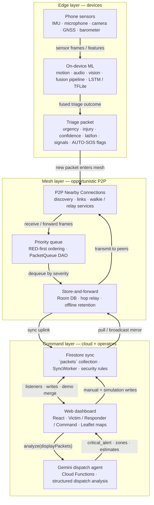

# OmniMesh system architecture

OmniMesh connects edge devices in disaster scenarios through opportunistic mesh relay and a cloud command plane. The stack splits into **Edge** (sense + classify + originate triage data), **Mesh** (offline-capable relay), and **Command** (authoritative sync + operator tooling + AI-assisted dispatch).

**Frozen PNG export** (for decks, README gallery, or PDFs where Mermaid does not render):

  

_Source:_ [`screenshots/architecture-render.png`](screenshots/architecture-render.png) _(same graphic as repo-root `Edge Device Packet Dispatch May 10 2026.png`; regenerate when the diagram below changes.)_

---

## Mermaid source (editable)

## Layer summary

| Layer | Role | Key technical components |
| ----- | ---- | ------------------------ |
| **Edge** | Capture signals and produce standardized triage artifacts | Sensor pipelines, TFLite (or similar) classifiers, fusion logic, `TriagePacket`-shaped payloads |
| **Mesh** | Move packets device-to-device when infrastructure is degraded | Android Nearby-style P2P, mesh relay services, Room/local queues, priority-ordered forwarding |
| **Command** | Shared truth, visualization, and AI-assisted coordination | Firestore, React web app, Cloud Functions (or hosted agents) calling Gemini for dispatch-style analysis |

## Cross-cutting flows

1. **Edge → Mesh**: A completed triage packet enters the mesh egress path (broadcast or targeted relay depending on implementation).
2. **Mesh ↔ Command**: When connectivity allows, packets sync to Firestore; other nodes may receive updates from the cloud as well as from peers.
3. **Command → operators**: The dashboard reflects live packet streams and triggers Gemini-backed dispatch analysis without replacing the authoritative packet store in Firestore.
